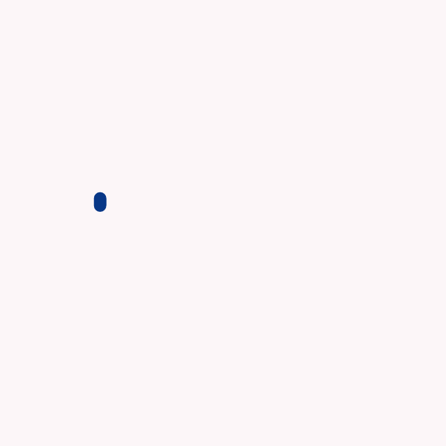

<h1> Hi There
</h1>
<h2>I Am Sufiyan Khanzada</h2>

### Contact

Reach out to me directly through:

### Tech Stack

Here's my tech stack I'm currently used to and prefer:

  
  
  
  
  
  
  
  
  

 
### Stats

 ### Featured
 

<!--
**Sufiyan Khanzada/Sufiyan Khanzada** is a ✨ _special_ ✨ repository because its `README.md` (this file) appears on your GitHub profile.

Here are some ideas to get you started:

- 🔭 I’m currently working on ...
- 🌱 I’m currently learning ...
- 👯 I’m looking to collaborate on ...
- 🤔 I’m looking for help with ...
- 💬 Ask me about ...
- 📫 How to reach me: ...
- 😄 Pronouns: ...
- ⚡ Fun fact: ...
-->
